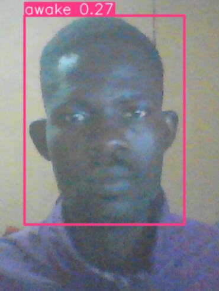
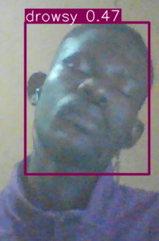

# Drowsiness Detection
Three Major Processes
#### Data Collection
Collected images dipicting drowsiness vs awake, stored it in **data/**
Created labels using the labelImg repository/package

#### Training/Generating model
Trained on Google Colab, see **DROWSINESS.ipynb**, using the 
famed YOLOv5 <mark>a family of object detection architectures and models pretrained on the COCO dataset, and represents Ultralytics open-source research into future vision AI methods, incorporating lessons learned and best practices evolved over thousands of hours of research and development</mark>.

Downloaded Model => **last.pt**

#### Realtime Detection
Run in realtime, see **realtime_drowsiness.py**

### Results

