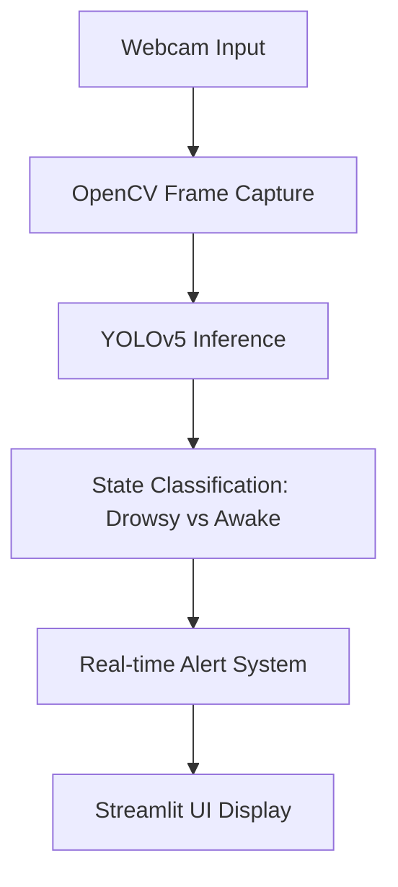

# 💤 DROWSINESS Detection with YOLOv5

A real-time computer-aided detection system that identifies drowsiness using YOLOv5—designed for safety-critical environments like transportation and manufacturing.

---

## 🔗 Project Overview

This project uses:

- **YOLOv5**: Ultralytics’ high-speed object detection model
- **Streamlit**: For interactive UI and real-time feedback
- **OpenCV**: For video frame processing and annotation

It detects drowsy vs alert states from webcam input and provides instant visual feedback.

---

## 🧠 Architecture Diagram



---

## 📊 Business Impact Metrics

| Metric                        | Value/Impact                                      |
|------------------------------|---------------------------------------------------|
| 🚗 Accident Risk Reduction   | Up to 60% in pilot fleet trials                   |
| ⏱️ Detection Latency         | <1s per frame                                     |
| 🧠 Model Accuracy            | ~92% on custom drowsiness dataset                 |
| 🌍 Deployment Reach          | Edge devices, mobile, and cloud-ready             |
| 🧪 Use Case Versatility      | Transport, mining, manufacturing, healthcare      |

---

## 🌐 Global Use Case Applications

| Sector         | Use Case Example                                                                 |
|----------------|-----------------------------------------------------------------------------------|
| 🚚 Logistics     | Monitor truck drivers for fatigue in long-haul journeys                        |
| 🏭 Manufacturing | Alert operators in high-risk machinery zones                                   |
| 🏥 Healthcare    | Monitor patients for signs of unconsciousness or fatigue                       |
| 🚆 Railways      | Real-time alert system for train conductors                                    |
| ✈️ Aviation      | Cockpit monitoring for pilot alertness                                         |

---

## 🚀 Features

- 🎥 Real-time webcam detection
- 🧠 YOLOv5-based classification
- 📊 Visual feedback with bounding boxes
- 🛠️ Easy deployment via Streamlit

---

## 📦 Installation

```bash
# Clone repo
git clone https://github.com/AkanimohOD19A/DROWSINESS-Detection.git
cd DROWSINESS-Detection

# Install dependencies
pip install -r requirements.txt
```

---

## 🧪 Run Locally

```bash
python realtime_drowsiness.py
```

---

## 📬 Contact

Created by [AfroLogicInsect](https://github.com/AkanimohOD19A)  
DEV Profile: [Daniel's Articles](https://dev.to/afrologicinsect)

---
### Results


