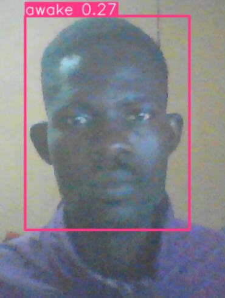
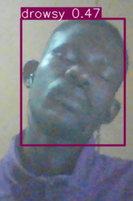

# Drowsiness Detection
Three Major Process
#### Data Collection
Collected images of drowsiness vs awake,
renamed files

#### Training/Generating model
Trained on Google Colab, see ipynb, using the 
famed YOLOv5 ==a family of object detection architectures and models pretrained on the COCO dataset, and represents Ultralytics open-source research into future vision AI methods, incorporating lessons learned and best practices evolved over thousands of hours of research and development==.

Downloaded Model

#### Realtime Detection
See python script

### Results

